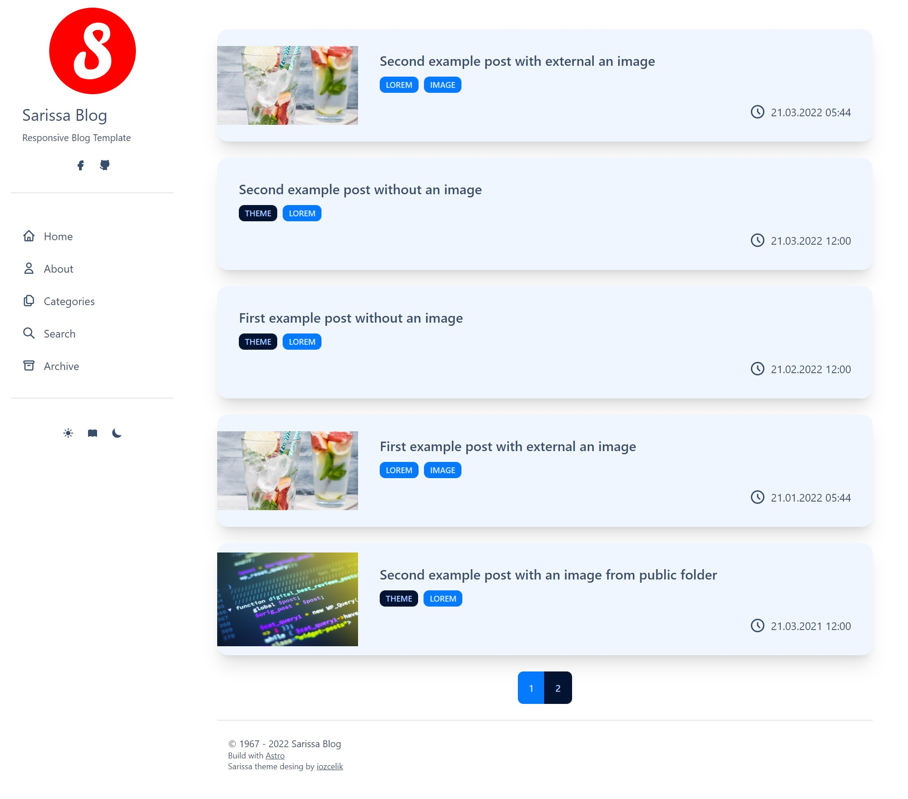

# Astro Sarissa Blog Theme

Responsive, functional, personal blog theme for Astro.



Sarissa Blog theme created to serve markdown-based personel blog needs.

## Features

- Responsive and functional
- Markdown-based blog
- 3 Color Mode (Light, Book, Dark)
- Easy site configration
- Built-in article title and description search
- Support draft page
- Pagination for archive and category view

## Used libraries

- **CSS Framework:** [Tailwind](https://tailwindcss.com/)
- **Component library:** [DaisyUI](https://daisyui.com/)
- **Fuzzy Search:** [Fuse.js](https://fusejs.io/)
- **Date & Time:** [Luxon](https://moment.github.io/luxon/#/)
- **Theme Changer:** [Theme change](https://github.com/saadeghi/theme-change)

## Site Configuration

```cjs
  //Web site title. It is visible in sidebar and browser
  siteTitle: "Sarissa Blog",
  //Web site desciption. It is visible in sidebar. Also added head meta data.
  siteDescription: "Responsive Blog Template",
  //Web site favicon
  favicon: "/favicon.ico",
  //Web site image. It is visible in sidebar
  siteImagePath: "/images/sarissa.png",
  //Override footer text.
  footer: "© 1967 - 2022 Sarissa Blog",
  //Site global date format. [Luxon](https://moment.github.io/luxon/#/parsing?id=table-of-tokens)
  dateFormat: "dd.MM.yyyy HH:mm",
  //Add social media name to visible sidebar
  socialMedia: {
    facebook: "ozcelikismail",
    twitter: "ismailozcelik",
    linkedin: "ismail-özçelik",
    github: "iozcelik",
  },
  //Default page size for home page, category and archive
  pageSize: 5,
  //Customize category. Name is requried.
  //color for button and badges
  //image: if category layout is card, image shown at background in card.
  //order: override order of category
  categories: [
    {
      name: "theme",
      color: "btn-warning",
      image: "/images/theme.jpg",
      order: 1,
    },
  ],
  //Deafult category settings
  //order: categories can be ordered by name and count except overrided categories
  //layout: card and button
  //image: if category layout is card, image shown at background in card.
  //color: for button and badges
  //countVisibility: category has how many post shown on button or card
  categorySettings: {
    order: "name", // name | count
    layout: "card", //button | card
    image: "",
    color: "btn-primary",
    countVisibility: true,
  },
  //fuse.js search options. Detail information at [fuse.js](https://fusejs.io/api/options.html)
  searchOptions: {
    includeScore: true,
    includeMatches: true,
    keys: [
      { name: "title", weight: 3 },
      { name: "description", weight: 2 },
    ],
  },
  //Customize the labels
  menu: {
    home: "Home",
    about: "About",
    categories: "Categories",
    search: "Search",
    archive: "Archive",
  },
  //Translate labels
  i18n: {
    search: {
      placeholder: "Search post title and description...",
    },
    archive: {
      select: "Select Year",
    },
    page: "Page",
    resultFound: " result(s) found",
  },
```

## Built with Sarrisa Blog
- [İsmail Özçelik](https://ismailozcelik.com/) - My personal blog site
Open an issue to listed here.

## Support

If this template helped you, buy me a coffee.

<a href="https://www.buymeacoffee.com/ismailozcelik" target="_blank"></a>

## License

This template is MIT licensed. 
